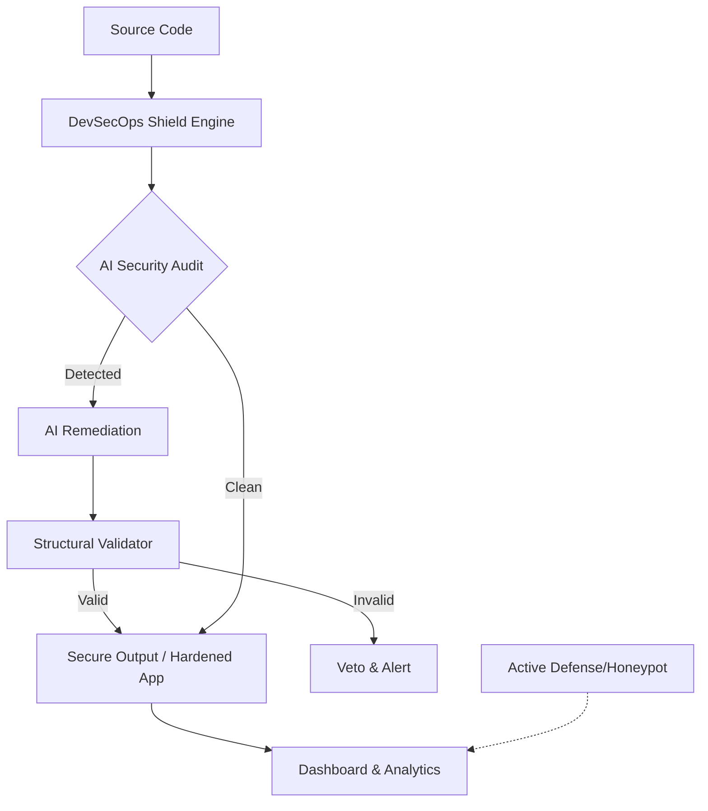

# 🛡️ Labyrinth Forge: Autonomous DevSecOps Shield

[](https://github.com/)
[](https://opensource.org/licenses/MIT)
[](https://www.python.org/)
[](https://reactjs.org/)

**Labyrinth Forge** is a next-generation, AI-first DevSecOps platform designed to automate the detection, remediation, and validation of security vulnerabilities in real-time. By integrating advanced machine learning with structural code analysis, Labyrinth Forge transforms passive security scanning into an active defense mechanism.

---

## ✨ Key Features

- **🤖 AI-First Remediation:** Automatically generates secure patches for detected vulnerabilities using state-of-the-art LLMs.
- **🛡️ DevSecOps Shield Engine:** A multi-layered security orchestra that scans, scores, and hardens code dynamically.
- **📊 Interactive Dashboard:** Real-time visualization of security metrics, attack surfaces, and remediation history using React, Recharts, and XYFlow.
- **⚡ Autonomous Gatekeeping:** Structural validation prevents insecure or broken AI-generated fixes from entering production.
- **🪤 Active Defense (Honeypots):** Intelligent decoy systems to redirect and analyze malicious traffic.
- **📈 Security Scoring:** Every file is assigned an integrity score (0-100) before and after hardening.
- **🚀 CI/CD Ready:** Seamless integration with GitHub Actions for automated security checks on every push.

---

## 🏗️ Architecture



---

## 🚀 Getting Started

### Prerequisites

- **Python 3.9+**
- **Node.js 18+**
- **AI Backend API Key** (Configured in `.env`)

### Installation

1. **Clone the Repository:**
   ```bash
   git clone https://github.com/your-username/LABYRINTH-FORGE.git
   cd LABYRINTH-FORGE
   ```

2. **Backend Setup:**
   ```bash
   cd backend
   python -m venv venv
   source venv/bin/activate  # On Windows: venv\Scripts\activate
   pip install -r requirements.txt
   ```

3. **Frontend Setup:**
   ```bash
   cd ../frontend
   npm install
   ```

### Configuration

Create a `.env` file in the root and backend directories:
```env
GEMINI_API_KEY=your_key_here
SSH_PASSWORD=your_secure_password
```

---

## 🛠️ Usage

### Running the Security Engine
To scan and remediate a specific file:
```bash
python -m devsecops_shield.main path/to/vulnerable_file.py
```

### Starting the Platform
- **Backend:** `python backend/main.py`
- **Frontend:** `npm run dev` (from the `frontend` directory)

---

## 🔧 Tooling & Automation

Labyrinth Forge comes with built-in scripts to streamline DevSecOps workflows:

- **GitHub Issue Creator:** A powerful CLI/Interactive tool (`scripts/create_github_issue.py`) to automate vulnerability reporting and task management directly to your repository.
- **Environment Cleanup:** `cleanup.py` helps maintain a clean build environment and remove temporary security artifacts.
- **Firewall & Remediation Scripts:** PowerShell scripts (`firewall_fix.ps1`, `super_fix.ps1`) for automated system-level hardening.

---

## 🧩 Components

- **`devsecops_shield`**: The core logic for AI-powered code analysis and structural validation.
  - **Supreme AI Security Oracle:** A specialized AI agent (powered by GROQ) that performs deep cognitive audits and zero-day resilient reconstructions.
- **`shield_engine`**: High-performance scanning and remediation modules.
- **`backend`**: Secure API services and active defense (honeypot) implementations.
- **`frontend`**: Modern, glassmorphic dashboard for real-time security monitoring.

---

## 🧪 Testing

Run the test suite to ensure all security modules are functioning correctly:
```bash
pytest tests/
```

---

## 🤝 Contributing

Contributions are welcome! Please read our [Contributing Guidelines](CONTRIBUTING.md) and submit a Pull Request.

---

## 📄 License

This project is licensed under the MIT License - see the [LICENSE](LICENSE) file for details.

---

<p align="center">
  Built with ❤️ for a safer digital world.
</p>
